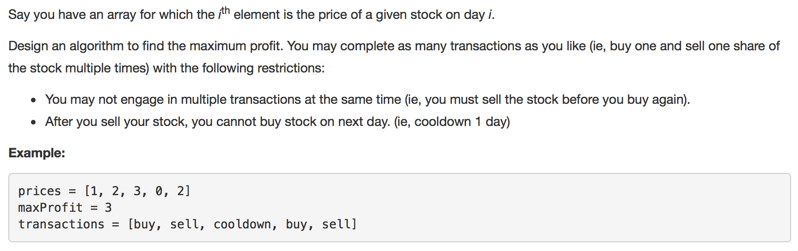
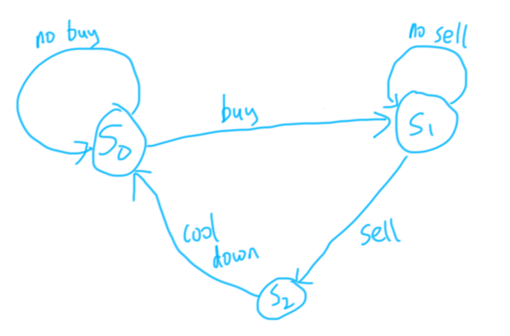

# **LeetCode 309**
https://leetcode.com/problems/best-time-to-buy-and-sell-stock-with-cooldown/description/

Yifeng Zeng

# Description
[309. Best Time to Buy and Sell Stock with Cooldown](https://leetcode.com/problems/best-time-to-buy-and-sell-stock-with-cooldown/description/)



# Idea Report
We can draw a turing machine:


| state                       | init | $1  | $2  | $3  | $0  | $2  |
| --------------------------- | ---- | --- | --- | --- | --- | --- |
| s0 no stock, can buy        | 0    | 0   | 0   | 1   | 2   | 2   |
| s1 has stock, can sell      | -1   | -1  | -1  | -1  | 1   | 1   |
| s2 just sold, cool cooldown | 0    | 0   | 1   | 2   | -1  | 3   |

s0[i] = Max(s0[i-1], s2[i-1]) // (still no stock, recover from cool down), no trade at all

s1[i] = Max(s1[i-1], s0[i-1] - price[i]) // (still has stock, buy stock today)

s2[i] = s1[i-1] + price[i] // sell stock today

To get to state s0, either we were still s0 and did not buy stock, or we were s2 in cool down.

To get to state s1, either we were sitll s1 and did not sell stock, or we just bought today's stock and transfer from s0. If we bought today's stock then the money we have should decrese by today's stock price (- price[i]).

To get to state s2, we must sell stock today and transfer from s1, then the money we have should increase by today's stock price (+ price[i]).


Code
```java
public class Solution {
    // DP AC
    public int maxProfit(int[] prices) {
        if (prices.length < 2) {
            return 0;
        }
        int length = prices.length;
        int[] s0 = new int[length + 1];
        int[] s1 = new int[length + 1];
        int[] s2 = new int[length + 1];
        s1[0] = -prices[0];
        for (int i = 1; i <= length; i++) {
            s0[i] = Math.max(s0[i-1], s2[i-1]);
            s1[i] = Math.max(s1[i-1], s0[i-1] - prices[i-1]);
            s2[i] = s1[i-1] + prices[i-1];
        }

        return Math.max(s0[length], Math.max(s1[length], s2[length]));
    }
}
```

Rolling array to optimize space

```java
class Solution {
  // DP AC
  public int maxProfit(int[] prices) {
    if (prices.length < 2) {
        return 0;
    }
    int length = prices.length;
    int[] s0 = new int[2];
    int[] s1 = new int[2];
    int[] s2 = new int[2];
    s1[0] = -prices[0];
    for (int i = 1; i <= length; i++) {
        s0[i % 2] = Math.max(s0[(i - 1) % 2], s2[(i - 1) % 2]);
        s1[i % 2] = Math.max(s1[(i - 1) % 2], s0[(i - 1) % 2] - prices[i - 1]);
        s2[i % 2] = s1[(i - 1) % 2] + prices[i - 1];
    }

    return Math.max(s0[length % 2], Math.max(s1[length % 2], s2[length % 2]));
  }
}
```

# Summary
- Drawing a finite state machine may be very helpful
- Use rolling array to optimize space
